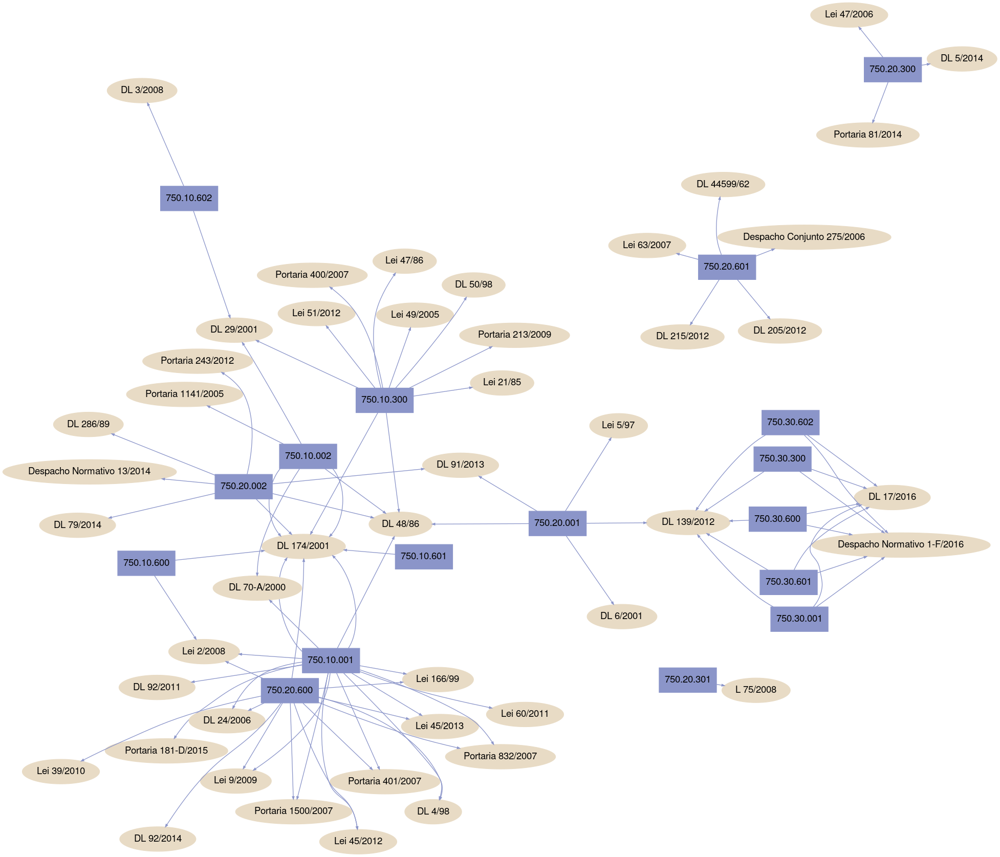

# pl2

### Assignment for a Language Processing course - using gawk to optimize CSV files and processing it's information to generate graphs using graphviz

The first input file we have is as CSV bloated with useless lines and ineffiecient formatting.

We first use gawk to generate a cleaner CSV, and then use gawk again to process that output file to produce a DOT file used by graphviz to generate graph such as the one in the picture below.

Note: the scripts are using software commonly available in GNU/Linux systems, although of course they can be adjusted for whatever software we have installed in our system that perform the same tasks (e.g. using any other image viewer instead of 'eog' to view the graph generated..) 
